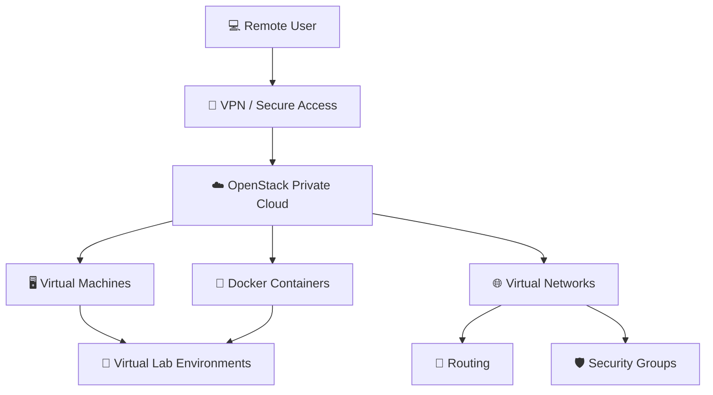

[README.md](https://github.com/user-attachments/files/32966798/README.md)
# OpenStack Private Cloud Infrastructure

A team capstone project completed at James Madison University focused on designing and implementing a private cloud environment for hands-on Information Technology labs.

The project explored how OpenStack and containerized infrastructure could be used to move networking and systems labs away from hardware-dependent environments and provide students with more flexible access to virtual infrastructure.
## Infrastructure Architecture


## Project Overview

The project began with Docker-based lab environments and later expanded into an OpenStack private cloud deployment. The final environment was designed to support student experimentation with networks, instances, containers, security groups, users, projects, and cloud administration.

The work included extensive deployment testing, troubleshooting, infrastructure configuration, and development of lab material that could be used by other IT students.

## Technologies and Concepts

- OpenStack
- Kolla-Ansible
- Docker
- Docker Compose
- Linux
- Virtual machines
- Container networking
- Internal and external networks
- Routers and subnets
- Security groups
- Cloud instances
- User and project administration
- Cloud storage and volumes
- MongoDB / Mongo Express container labs
- Infrastructure troubleshooting

## Project Goals

The project was designed to:

- Build a functional private cloud environment using OpenStack
- Create internal and external cloud networks
- Create and manage virtual machine instances
- Explore container deployment in cloud environments
- Configure users, projects, security groups, and administrative controls
- Develop repeatable labs for IT students
- Reduce dependence on dedicated physical networking hardware for coursework
- Explore remote access to cloud-hosted lab environments

## Implementation

The first phase focused heavily on Docker and container networking. This included learning container lifecycle management, Docker Compose, networking between containers on different subnets, and creating a MongoDB/Mongo Express lab environment.

The project later shifted toward OpenStack. The team deployed and configured an OpenStack environment, created networks and instances, worked with security groups and projects, and developed labs around both deployment and day-to-day use of the cloud platform.

The final project documentation contains the full implementation narrative, lab development, testing results, network diagrams, screenshots, and discussion of technical challenges encountered during the project.

## Repository Contents

```text
openstack-private-cloud-infrastructure/
├── README.md
└── docs/
    ├── final-implementation-report.pdf
    └── original-project-proposal.pdf
```

### Final Implementation Report

`docs/final-implementation-report.pdf` contains the completed capstone report, including:

- Project objectives and deliverables
- Solution architecture
- Implementation process
- Docker and OpenStack lab development
- Pilot testing and results
- Network diagrams
- Screenshots of the environment
- Troubleshooting and lessons learned

### Original Project Proposal

`docs/original-project-proposal.pdf` documents the original project scope and planned approach before implementation.

## Team Project Notice

This was a collaborative James Madison University capstone completed by Katherine Botticelli and Casey Alexander. The documentation is preserved as a record of the team's work and does not represent an individual-only project.

## What I Learned

This project provided hands-on experience working with cloud infrastructure beyond isolated classroom exercises. It required learning unfamiliar technologies, troubleshooting deployment failures, configuring networking and security controls, and turning technical work into repeatable instructions that other students could follow.

The project also reinforced how networking, virtualization, containers, security, storage, and user administration interact inside a larger infrastructure environment.

## Portfolio Note

This repository documents an academic infrastructure project and is intended to demonstrate hands-on experience with private cloud architecture, containerization, networking, systems administration, troubleshooting, and technical documentation.
